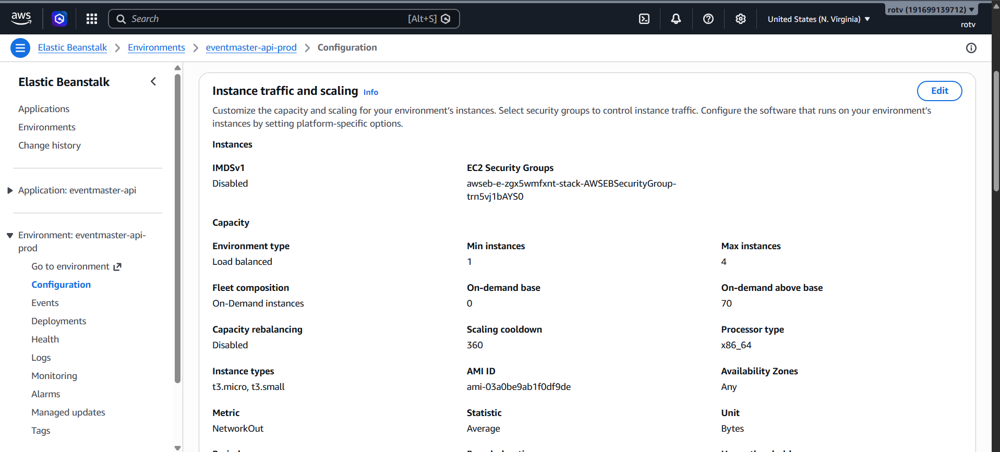
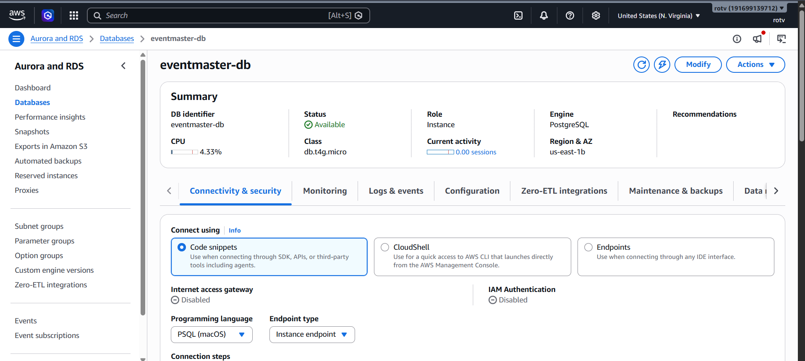
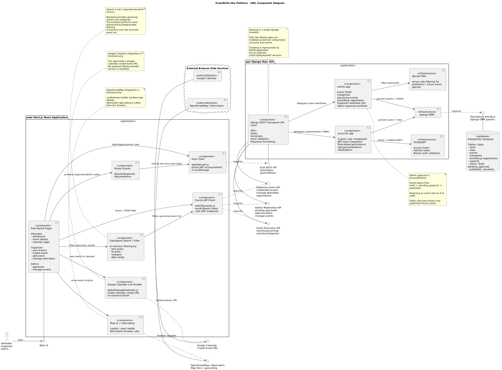
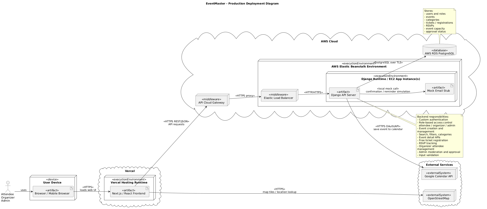
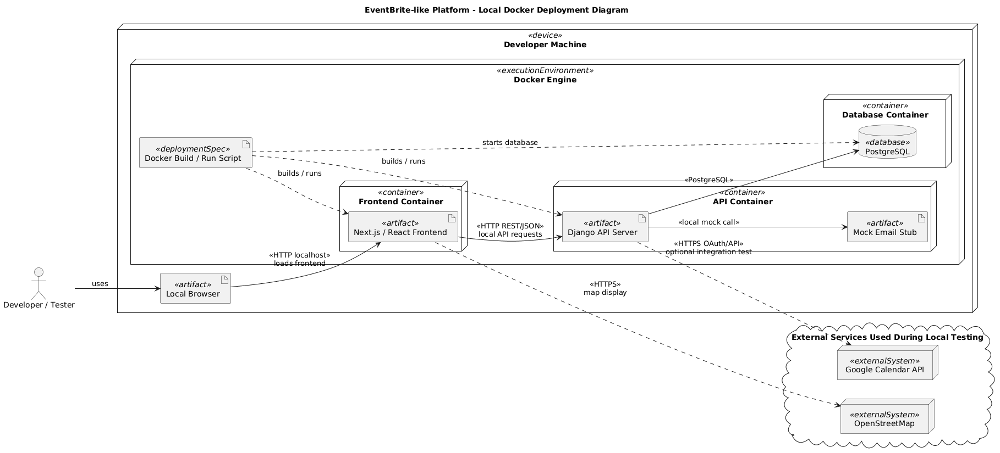
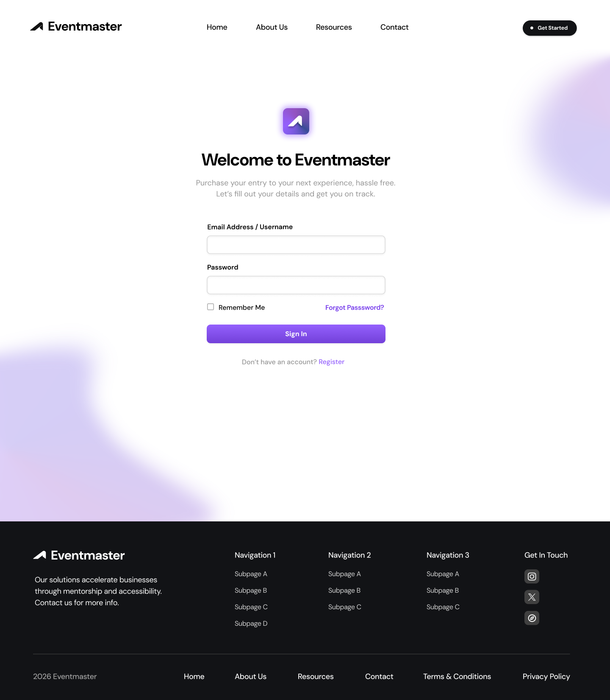
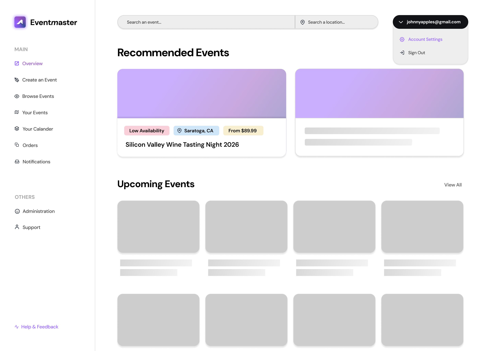
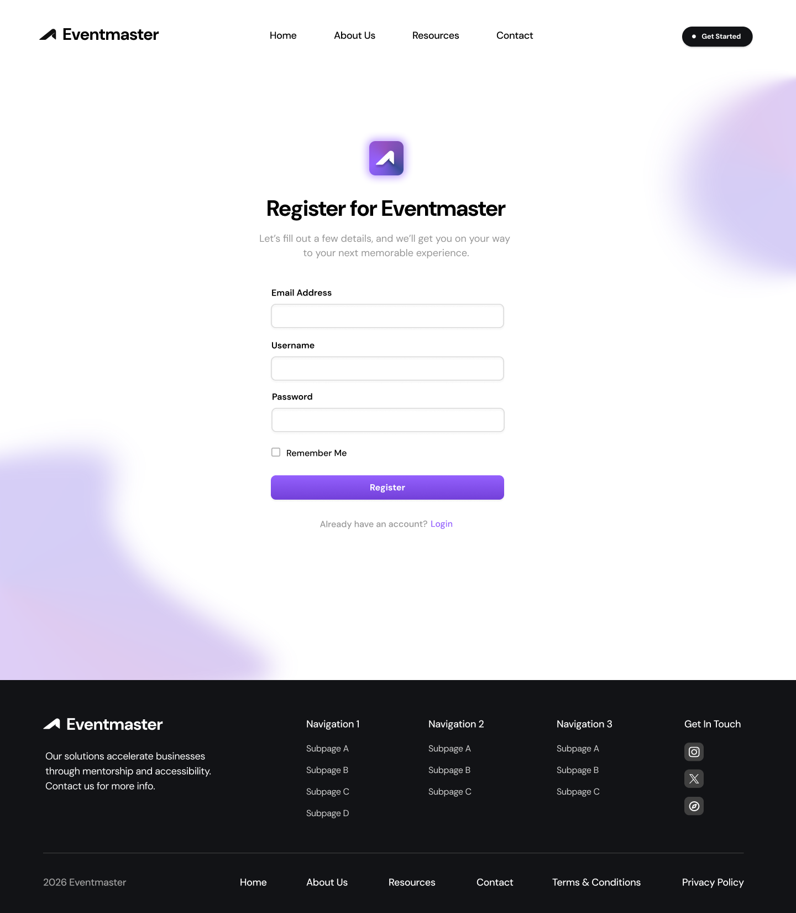
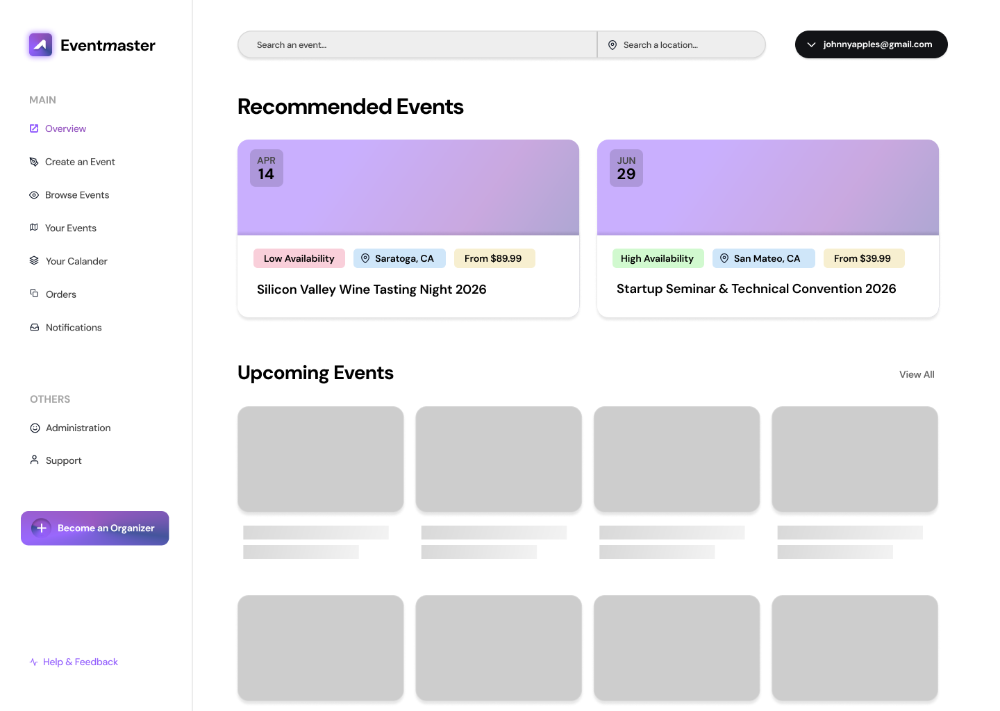
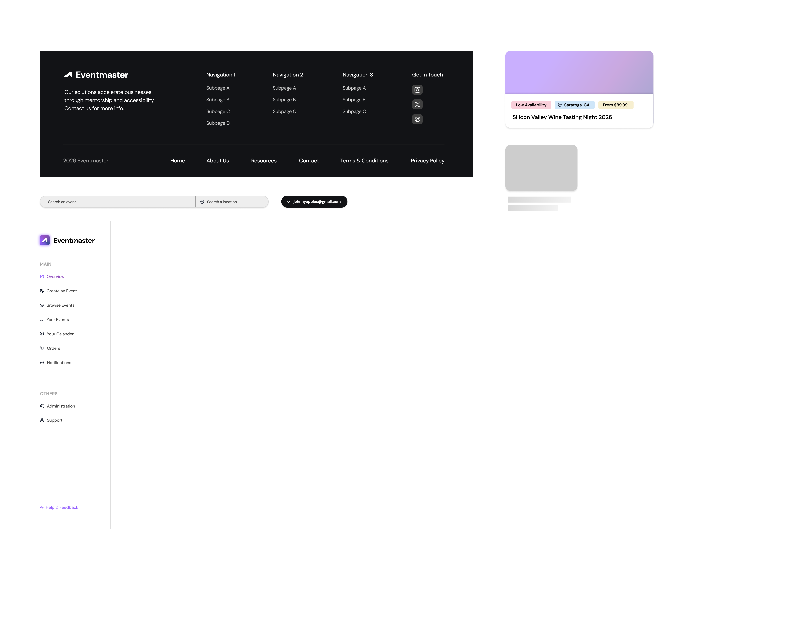

# Eventmaster

Eventmaster is an EventBrite-like platform for discovering events, registering for tickets, and managing event operations across attendee, organizer, and admin roles.

## 1) Project Info

**Project:** Eventmaster  
**Goal:** Build and deploy a full-stack event platform with role-based access, event management, registration, and deployment-ready APIs.

**Live demo URLs:**
- Frontend: https://eventmaster-web-psi.vercel.app/
- API Base URL: `<insert link>`

## 2) Team And Ownership

| Team Member | GitHub | 
|---|---|
| Aaron Jiang | https://github.com/ajiaron | 
| Rohan Ohlan | https://github.com/rohan328 | 
| Bhimsen Chhetri | https://github.com/bhimsenthapa1 | 
| Michael Kao | https://github.com/mkao823 | 

### Summary Of Contributions
- **Aaron Jiang**: Frontend implementation, frontend-backend integration, and service integration.
- **Rohan Ohlan**: Backend development and cloud deployment work.
- **Bhimsen Chhetri**: Diagrams and UI component development.
- **Michael Kao**: Backend implementation and service integrations.

## 3) Agile And Scrum Artifacts

- [Scrum Backlog Workbook](docs/ScrumBacklogWorkbook.pdf)
- [Weekly Scrum Report](docs/weeklyScrum.pdf)
- [XP Core Values Summary](docs/xpCoreValues.pdf)

## 4) Feature Set 

| Requirement  | Status | Evidence (API / UI / Cloud) |
|---|---|---|
| User authentication and role-based access (attendee/organizer/admin) | `Done` | `POST /api/auth/login/`, `GET/PATCH /api/auth/me/`, role-gated UI pages |
| Event creation and management (date, time, location, capacity) | `Done` | `POST /api/events/`, `PUT/PATCH/DELETE /api/events/<id>/`, create/manage UI |
| Event discovery (search/filters/category browsing) | `Done` | Discovery pages and category APIs (`/api/events/upcoming/`, `/api/events/categories/`) |
| Event detail (description, schedule, organizer info) | `Done` | `GET /api/events/<id>/` and event detail UI |
| Ticketing and registration (free payment) | `Done` | RSVP registration APIs (`/api/events/<id>/rsvp/`) + free event fields |
| Calendar integration (Google Calendar) | `Done` | Event detail action opens Google Calendar URL |
| Location and map integration (in-person/hybrid events) | `Done` | Leaflet map on event detail for in-person/hybrid events with coordinates |
| RSVP tracking and attendee management (organizers) | `Done` | Organizer attendee list/remove registration APIs and UI pages |
| Email/notification service (confirmations) | `Done` | RSVP confirmation + organizer RSVP notification implemented|
| Admin moderation and event approval workflow | `Done` | `/api/events/admin/pending/`, `/approve/`, `/reject/`, admin approvals UI |
| Secure API design with input validation | `Done` | DRF serializers/permissions, JWT auth, role checks, validation error handling |
| Responsive and accessible web/mobile UI | `Done` | Responsive pages implemented; accessibility checks ongoing |
| Deployed API + DB in cloud with load balancer | `Done` | <br/> |

## 5) Tech Stack

### Frontend
- Next.js (App Router)
- React
- Sass/CSS Modules
- Leaflet (map integration)

### Backend
- Django
- Django REST Framework (DRF)
- Simple JWT authentication
- PostgreSQL

### Infrastructure And Tooling
- Docker Compose (local orchestration)
- GitHub (version control and collaboration)
- Load balanced AWS Elastic Beanstalk environment for API backend
- AWS managed RDS environment for postgres database
- Vercel for frontend deployment

## 6) Architecture Overview

### System Flow
1. Web UI sends JSON requests to REST API.
2. API validates/authenticates requests using JWT + role permissions.
3. API reads/writes PostgreSQL data and returns JSON responses.
4. UI renders role-aware experiences for attendee, organizer, and admin.

### Architecture Diagrams 
- Component Diagram: 
 
- Deployment Diagram Production:
 
- Deployment Diagram Dev:
 

## 7) API Summary (JSON, Validation, Errors)

All APIs use JSON input/output and include input validation plus error responses.

### Auth APIs
- `POST /api/auth/register/`
- `POST /api/auth/login/`
- `POST /api/auth/token/refresh/`
- `GET/PATCH /api/auth/me/`

### Event APIs 
- `GET /api/events/upcoming/`
- `GET /api/events/<id>/`
- `POST /api/events/` (organizer/admin)
- `PUT/PATCH/DELETE /api/events/<id>/` (owner organizer/admin)
- `POST /api/events/<id>/rsvp/`
- `DELETE /api/events/<id>/rsvp/`
- `GET /api/events/<id>/registrations/` (organizer/admin)
- `DELETE /api/events/<id>/registrations/<user_id>/` (organizer/admin)
- `GET /api/events/admin/pending/` (admin)
- `POST /api/events/<id>/approve/` (admin)
- `POST /api/events/<id>/reject/` (admin)

### Error Handling
- Validation errors: HTTP 400 with field-level messages
- Unauthorized: HTTP 401
- Forbidden: HTTP 403
- Not found: HTTP 404

## 8) Roles And Access Control 

### Attendee
- Register/login and maintain a personal profile
- Discover published events
- View event details
- RSVP/register for published events (subject to capacity/rules)
- Add events to calendar

### Organizer
- Create and manage their own events
- Track and manage attendee registrations
- Access organizer-specific management pages

### Admin
- View pending events for moderation
- Approve or reject events
- Access admin-only workflows and pages

## 9) Local Setup And Run

### Prerequisites
- Docker Desktop (or Docker Engine + Compose)

### Run Locally
From repository root:

```bash
docker compose up --build
```

### Service URLs
- Web UI: `http://localhost:3000`
- API: `http://localhost:8000/api`
- Health check: `http://localhost:8000/api/health/`

### Optional Useful Commands

```bash
# Run in background
docker compose up --build -d

# View API logs (email demo output appears here)
docker compose logs -f api

# Stop containers
docker compose down

# Reset local DB volume (destructive)
docker compose down -v
```

## 10) UI Wireframes

UI Wireframes
- Login


- Logout Dashboard


- Register


- User Dashboard


- Components


## 11) License And Acknowledgements

### License
San Jose State University 2026

### Acknowledgements
- CMPE project guidance and rubric
- Open-source libraries used in this repository
